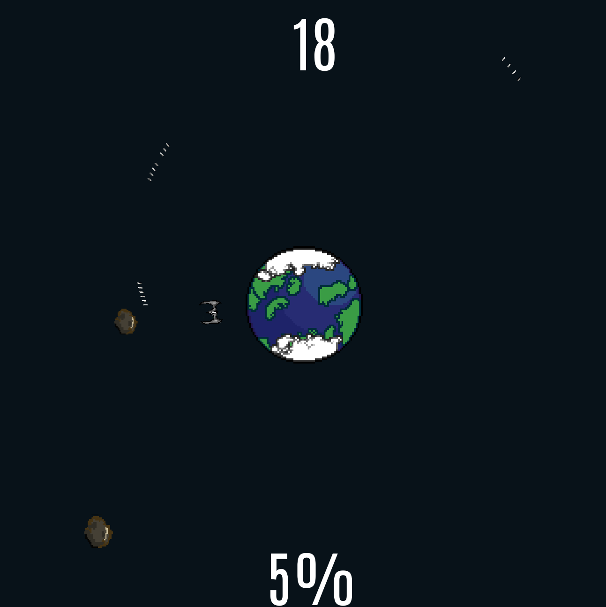

<!--
*** Thanks for checking out the Best-README-Template. If you have a suggestion
*** that would make this better, please fork the repo and create a pull request
*** or simply open an issue with the tag "enhancement".
*** Don't forget to give the project a star!
*** Thanks again! Now go create something AMAZING! :D
-->

<!-- PROJECT SHIELDS -->
<!--
*** I'm using markdown "reference style" links for readability.
*** Reference links are enclosed in brackets [ ] instead of parentheses ( ).
*** See the bottom of this document for the declaration of the reference variables
*** for contributors-url, forks-url, etc. This is an optional, concise syntax you may use.
*** https://www.markdownguide.org/basic-syntax/#reference-style-links
-->
[![Contributors][contributors-shield]][contributors-url]
[![Forks][forks-shield]][forks-url]
[![Stargazers][stars-shield]][stars-url]
[![Issues][issues-shield]][issues-url]
[![MIT License][license-shield]][license-url]
[![LinkedIn][linkedin-shield]][linkedin-url]

<!-- PROJECT LOGO -->
 

  

  <h3 align="center">Last Line</h3>

  

    2D OpenGL based game where you are Earth's last line of defense!
     
    <a href="https://github.com/BryGo1995/last-line"><strong>Explore the docs »</strong></a>
     
     
    <a href="https://github.com/BryGo1995/last-line">View Demo</a>
    ·
    <a href="https://github.com/BryGo1995/last-line/issues">Report Bug</a>
    ·
    <a href="https://github.com/BryGo1995/last-line/issues">Request Feature</a>
  

<!-- TABLE OF CONTENTS -->

  
Table of Contents

  <ol>
    <li>
      <a href="#about-the-project">About The Project</a>
      <ul>
        <li><a href="#built-with">Built With</a></li>
      </ul>
    </li>
    <li>
      <a href="#getting-started">Getting Started</a>
      <ul>
        <li><a href="#prerequisites">Prerequisites</a></li>
        <li><a href="#installation">Installation</a></li>
      </ul>
    </li>
    <li><a href="#usage">Usage</a></li>
    <li><a href="#roadmap">Roadmap</a></li>
    <li><a href="#contributing">Contributing</a></li>
    <li><a href="#license">License</a></li>
    <li><a href="#contact">Contact</a></li>
    <li><a href="#acknowledgments">Acknowledgments</a></li>
  </ol>

<!-- ABOUT THE PROJECT -->
## About The Project

[![Product Name Screen Shot][gameplay-screenshot]]()

2D OpenGL game where you are Earth's last line of defense. Protect our planet from a barrage of asteroids hurdling across space in the direct path of Earth.

(<a href="#top">back to top</a>)

### Built With

* [OpenGL](https://www.opengl.org/)
* [glm](https://github.com/g-truc/glm)
* [FreeType](https://freetype.org/)
* [GLAD](https://glad.dav1d.de/)

(<a href="#top">back to top</a>)

<!-- GETTING STARTED -->
## Getting Started

### Prerequisites

### Installation

(<a href="#top">back to top</a>)

<!-- ROADMAP -->
## Roadmap

- [x] Add Base Game functionality
- [ ] Create nice looking pixel sprites for game objects
- [ ] Add different ship/gun mechanics
- [ ] Add additional enemies/objects
    - [ ] Other ships
    - [ ] Debris

See the [open issues](https://github.com/BryGo1995/last-line/issues) for a full list of proposed features (and known issues).

(<a href="#top">back to top</a>)

<!-- CONTRIBUTING -->
## Contributing

Contributions are what make the open source community such an amazing place to learn, inspire, and create. Any contributions you make are **greatly appreciated**.

If you have a suggestion that would make this better, please fork the repo and create a pull request. You can also simply open an issue with the tag "enhancement".
Don't forget to give the project a star! Thanks again!

1. Fork the Project
2. Create your Feature Branch (`git checkout -b feature/AmazingFeature`)
3. Commit your Changes (`git commit -m 'Add some AmazingFeature'`)
4. Push to the Branch (`git push origin feature/AmazingFeature`)
5. Open a Pull Request

(<a href="#top">back to top</a>)

<!-- LICENSE -->
## License

Distributed under the MIT License. See `LICENSE.txt` for more information.

(<a href="#top">back to top</a>)

<!-- CONTACT -->
## Contact

Bryan Gonzales  - bryanj.gonzales95@gmail.com

Project Link: [https://github.com/BryGo1995/last-line](https://github.com/BryGo1995/last-line)

(<a href="#top">back to top</a>)

<!-- ACKNOWLEDGMENTS -->
## Acknowledgments

* [LearnOpenGL](https://learnopengl.com/)

(<a href="#top">back to top</a>)

<!-- MARKDOWN LINKS & IMAGES -->
<!-- https://www.markdownguide.org/basic-syntax/#reference-style-links -->
[contributors-shield]: https://img.shields.io/github/contributors/BryGo1995/last-line.svg?style=for-the-badge
[contributors-url]: https://github.com/BryGo1995/last-line/graphs/contributors
[forks-shield]: https://img.shields.io/github/forks/BryGo1995/last-line.svg?style=for-the-badge
[forks-url]: https://github.com/BryGo1995/last-line/network/members
[stars-shield]: https://img.shields.io/github/stars/BryGo1995/last-line.svg?style=for-the-badge
[stars-url]: https://github.com/BryGo1995/last-line/stargazers
[issues-shield]: https://img.shields.io/github/issues/BryGo1995/last-line.svg?style=for-the-badge
[issues-url]: https://github.com/BryGo1995/last-line/issues
[license-shield]: https://img.shields.io/github/license/BryGo1995/last-line.svg?style=for-the-badge
[license-url]: https://github.com/BryGo1995/last-line/blob/master/LICENSE.txt
[linkedin-shield]: https://img.shields.io/badge/-LinkedIn-black.svg?style=for-the-badge&logo=linkedin&colorB=555
[linkedin-url]: https://www.linkedin.com/in/bryan-gonzales-2b3408134/
[gameplay-screenshot]: doc/images/GamePlay1.PNG
